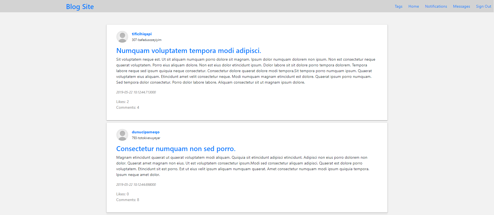

# A test blog

Deployed on Heroku: https://rmw-sample-blog.herokuapp.com/

This sample blog demonstrates the understanding of Python, Flask, and mainly SQL.

The `script.py` will populate a `blog.db` file. After the script is done, you can interact with that db file using a program like DB Browser: https://sqlitebrowser.org/

instead of running `script.py` and waiting for the test data to populate, you can get the zip with all the data here: https://drive.google.com/open?id=15piWKDyMNVFdwba1SM-oItkCpLgNpz9o

